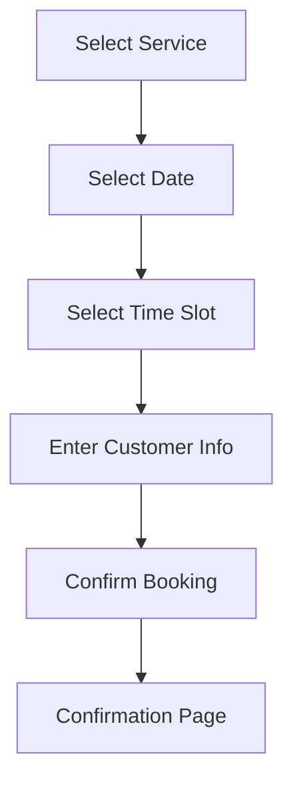

# Comprehensive Implementation Plan - APPOINTMENT Features

## Executive Summary

Based on thorough analysis of the project at `c:/Users/disso/Project/shadcn-rtl`, this document outlines a detailed implementation roadmap for completing the APPOINTMENT type organization features. The project is a multi-tenant, multi-locale Next.js 16 application with PostgreSQL, supporting both SHOP and APPOINTMENT organization types.

---

## 1. Project Architecture Analysis

### 1.1 Technology Stack
| Component | Technology |
|-----------|------------|
| Framework | Next.js 16.1.6 |
| UI Library | React 19.2.3 |
| Database | PostgreSQL with Prisma 6.19.2 |
| Authentication | NextAuth.js 5.0.0-beta.30 |
| UI Components | shadcn/ui + Radix UI |
| Styling | Tailwind CSS 4 |
| Animation | Framer Motion 12.34.2 |
| i18n | Custom implementation with fa, en, ar |

### 1.2 Current Project State

**✅ Completed Features:**
- Multi-locale routing with `/app/[locale]/` structure
- Full RTL support for Persian and Arabic
- Dashboard with sidebar navigation
- Authentication system with RBAC
- Complete API routes for all entities
- Prisma database schema
- Core UI components

**🔴 Missing Features (APPOINTMENT):**
- Public landing page for APPOINTMENT type organizations
- Service catalog with category navigation
- Public booking calendar
- Customer appointment calendar
- Staff appointment management calendar

---

## 2. Implementation Roadmap

### Phase 1: Foundation & Landing Page

#### 1.1 Organization Landing Page Structure
```
app/[locale]/
├── organizations/
│   └── [slug]/
│       ├── page.tsx          # Landing page
│       ├── layout.tsx        # Organization layout
│       ├── services/
│       │   └── page.tsx      # Service catalog
│       ├── booking/
│       │   └── page.tsx      # Booking flow
│       └── calendar/
│           └── page.tsx      # Public availability
```

#### 1.2 Landing Page Components
| Component | Purpose |
|-----------|---------|
| HeroSection | Organization branding, tagline, CTA |
| ServiceCategories | Grid of service categories |
| FeaturedServices | Highlighted popular services |
| BusinessHours | Operating hours display |
| LocationContact | Address, phone, map |
| Testimonials | Customer reviews |
| BookingCTA | Call-to-action for booking |

---

### Phase 2: Service Catalog

#### 2.1 Service Categories Grid
- Category cards with images
- Service count per category
- Quick navigation to services
- Search functionality

#### 2.2 Service Listing
- Service cards with:
  - Name, description, price
  - Duration
  - Provider info
  - Rating/reviews
- Filtering by category
- Sorting options

---

### Phase 3: Booking System

#### 3.1 Booking Flow


#### 3.2 Time Slot Calendar
- Weekly/monthly view
- Available slots highlighted
- Business hours integration
- Service duration consideration
- Conflict detection

#### 3.3 Booking API Endpoints
| Endpoint | Method | Description |
|----------|--------|-------------|
| `/api/services` | GET | List services |
| `/api/services/[id]` | GET | Service details |
| `/api/services/[id]/slots` | GET | Available slots |
| `/api/appointments` | POST | Create booking |
| `/api/appointments/[id]` | GET | Booking details |

---

### Phase 4: Calendar Views

#### 4.1 Customer Calendar
- Personal appointment list
- Upcoming appointments
- Past appointments
- Filter by status
- Cancel/reschedule options

#### 4.2 Staff/Admin Calendar
- Daily/weekly/monthly views
- All appointments for organization
- Filter by:
  - Service
  - Staff member
  - Status
- Drag-and-drop rescheduling
- Status management

#### 4.3 Calendar Components
| Component | Features |
|-----------|----------|
| CalendarGrid | Month/week/day views |
| AppointmentCard | Compact appointment display |
| TimeSlotPicker | Interactive slot selection |
| StatusBadge | Appointment status indicator |

---

## 3. Detailed Task Breakdown

### Task 1: Organization Landing Page
**Priority:** HIGH
**Files to create:**
- `app/[locale]/organizations/[slug]/page.tsx`
- `app/[locale]/organizations/[slug]/layout.tsx`
- `components/organization/hero-section.tsx`
- `components/organization/service-card.tsx`
- `components/organization/category-grid.tsx`
- `components/organization/business-hours.tsx`

### Task 2: Service Catalog
**Priority:** HIGH
**Files to create:**
- `app/[locale]/organizations/[slug]/services/page.tsx`
- `components/services/service-list.tsx`
- `components/services/service-filter.tsx`

### Task 3: Booking System
**Priority:** HIGH
**Files to create:**
- `app/[locale]/organizations/[slug]/booking/page.tsx`
- `components/booking/service-selector.tsx`
- `components/booking/date-picker.tsx`
- `components/booking/time-slot-picker.tsx`
- `components/booking/booking-form.tsx`
- `components/booking/confirmation.tsx`

### Task 4: Customer Calendar
**Priority:** MEDIUM
**Files to create:**
- `app/[locale]/my-appointments/page.tsx`
- `components/calendar/customer-calendar.tsx`
- `components/calendar/appointment-list.tsx`

### Task 5: Staff Calendar
**Priority:** MEDIUM
**Files to create:**
- `app/[locale]/dashboard/calendar/page.tsx`
- `components/calendar/staff-calendar.tsx`
- `components/calendar/appointment-modal.tsx`

---

## 4. Database Models (Already Defined)

### Key Models for APPOINTMENT
```prisma
model Organization {
  type         OrganizationType  // SHOP | APPOINTMENT
  // ... other fields
  serviceCategories ServiceCategory[]
  services          Service[]
  businessHours     BusinessHour[]
}

model Service {
  name        String
  price       Decimal
  duration    Int  // minutes
  categoryId  String
  serviceProviderId String?
}

model Appointment {
  date        DateTime
  startTime   DateTime
  endTime     DateTime
  status      AppointmentStatus
  customerId  String
  serviceId   String
}

model BusinessHour {
  day         DayOfWeek
  openTime    String  // "HH:mm"
  closeTime   String  // "HH:mm"
  isOpen      Boolean
}
```

---

## 5. API Structure

### Existing Services
- `AppointmentService` - CRUD + availability slots
- `OrganizationService` - Organization management
- `CategoryService` - Service categories

### New Endpoints Needed
| Method | Path | Handler |
|--------|------|---------|
| GET | `/api/organizations/[slug]` | Get org by slug |
| GET | `/api/services/[id]/slots` | Get available slots |
| GET | `/api/services/categories` | List categories |

---

## 6. Translations Required

### New Dictionary Keys
```json
{
  "organization": {
    "welcome": "خوش آمدید",
    "bookNow": "رزرو آنلاین",
    "ourServices": "خدمات ما",
    "businessHours": "ساعات کاری",
    "contactUs": "تماس با ما"
  },
  "booking": {
    "selectService": "انتخاب خدمات",
    "selectDate": "انتخاب تاریخ",
    "selectTime": "انتخاب زمان",
    "yourInfo": "اطلاعات شما",
    "confirm": "تأیید رزرو",
    "success": "رزرو با موفقیت انجام شد",
    "availableSlots": "زمان‌های خالی",
    "noSlots": "متأسفانه زمان خالی وجود ندارد"
  },
  "calendar": {
    "today": "امروز",
    "week": "هفته",
    "month": "ماه",
    "upcoming": "نوبت‌های آینده",
    "past": "نوبت‌های گذشته",
    "cancel": "لغو نوبت",
    "reschedule": "تغییر زمان"
  }
}
```

---

## 7. Implementation Priority

### P0 - Critical
1. Organization landing page (`/fa/organizations/[slug]`)
2. Service catalog
3. Booking flow with time slots

### P1 - Important
4. Customer appointment calendar
5. Staff/admin calendar view

### P2 - Nice to Have
6. Reviews/ratings
7. Online payment integration
8. Email/SMS notifications

---

## 8. Security Considerations

1. **Authentication** - Booking requires customer account (or guest checkout)
2. **Authorization** - Only staff can modify appointments
3. **Rate Limiting** - Prevent booking spam
4. **Input Validation** - All form data validated with Zod
5. **SQL Injection** - Prisma parameterized queries
6. **XSS** - React auto-escaping

---

## 9. Scalability Notes

1. **Database Indexing** - Already indexed on common queries
2. **Caching** - Use Next.js caching for service listings
3. **Pagination** - Implemented in all list endpoints
4. **Optimistic Updates** - For better UX

---

## 10. Next Steps

1. ✅ Confirm architecture understanding
2. ⏳ Begin Phase 1: Landing Page implementation
3. ⏳ Proceed to Phase 2-4 sequentially
4. ⏳ Add translations incrementally
5. ⏳ Test all booking flows

---

*Document Version: 1.0*
*Last Updated: 2026-02-22*
