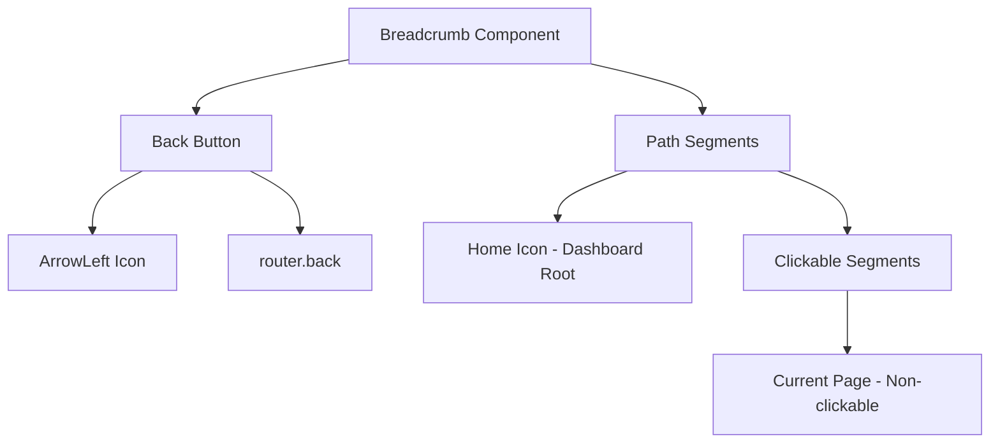
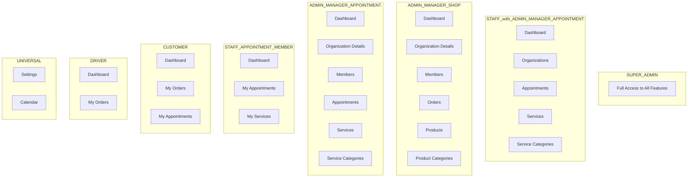
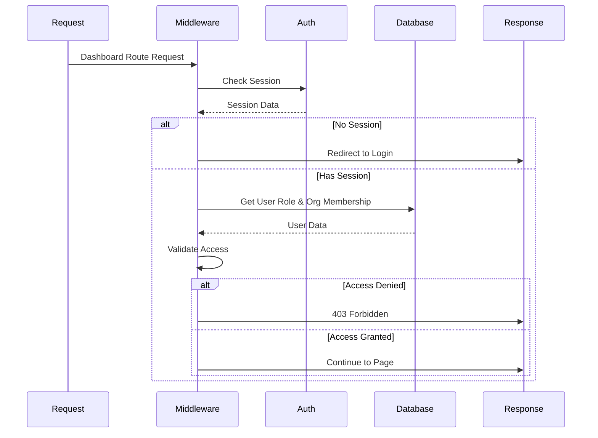

# Dashboard Breadcrumb Navigation & Access Control Implementation Plan

## Overview

This plan outlines the implementation of:
1. A breadcrumb navigation component with back button for dashboard pages
2. Comprehensive role-based access control system for dashboard routes

---

## Part 1: Breadcrumb Navigation Component

### 1.1 Component Structure

Create a new breadcrumb component at [`components/ui/breadcrumb.tsx`](components/ui/breadcrumb.tsx):



### 1.2 Features

- **Back Button**: Uses `ArrowLeft` icon from lucide-react, calls `router.back()` for navigation
- **Path Segments**: Automatically parses current pathname to generate breadcrumb items
- **Clickable Links**: Each parent segment is clickable for quick navigation
- **RTL Support**: Properly handles RTL direction with appropriate icons and spacing
- **Locale Support**: Includes locale prefix in all navigation links

### 1.3 Implementation Details

```typescript
// Breadcrumb segment structure
interface BreadcrumbSegment {
  label: string;      // Display label - translated
  href: string;       // Navigation link
  isCurrent: boolean; // Current page indicator
}

// Props interface
interface DashboardBreadcrumbProps {
  locale: string;
  customLabels?: Record<string, string>; // Override default labels
}
```

### 1.4 Pages to Update

Add breadcrumb to all dashboard subdirectory pages:

| Page | Path | Breadcrumb Path |
|------|------|-----------------|
| Dashboard | `/dashboard` | Dashboard |
| Orders | `/dashboard/orders` | Dashboard > Orders |
| Products | `/dashboard/products` | Dashboard > Products |
| Appointments | `/dashboard/appointments` | Dashboard > Appointments |
| Customers | `/dashboard/customers` | Dashboard > Customers |
| Settings | `/dashboard/settings` | Dashboard > Settings |
| Calendar | `/dashboard/calendar` | Dashboard > Calendar |

---

## Part 2: Role-Based Access Control System

### 2.1 Permission Structure



### 2.2 Access Control Matrix

| Role | OrgMemberRole | Org Type | Dashboard | Organizations | Members | Orders | Products | Appointments | Services | Settings | Calendar |
|------|---------------|----------|-----------|---------------|---------|--------|----------|--------------|----------|----------|----------|
| SUPER_ADMIN | - | - | ✅ | ✅ | ✅ | ✅ | ✅ | ✅ | ✅ | ✅ | ✅ |
| STAFF | ADMIN/MANAGER | APPOINTMENT | ✅ | ✅ | ❌ | ❌ | ❌ | ✅ | ✅ | ✅ | ✅ |
| ADMIN/MANAGER | ADMIN/MANAGER | SHOP | ✅ | ✅ | ✅ | ✅ | ✅ | ❌ | ❌ | ✅ | ✅ |
| ADMIN/MANAGER | ADMIN/MANAGER | APPOINTMENT | ✅ | ✅ | ✅ | ✅ | ❌ | ✅ | ✅ | ✅ | ✅ |
| STAFF | STAFF | APPOINTMENT | ✅ | ❌ | ❌ | ❌ | ❌ | My Only | My Only | ✅ | ✅ |
| CUSTOMER | - | - | ✅ | ❌ | ❌ | My Only | ❌ | My Only | ❌ | ✅ | ✅ |
| DRIVER | - | - | ✅ | ❌ | ❌ | My Only | ❌ | ❌ | ❌ | ✅ | ✅ |

### 2.3 Data Model Updates

The existing schema already supports the required structure:

```prisma
// Existing enums
enum UserRole {
  SUPER_ADMIN
  ADMIN
  MANAGER
  STAFF
  DRIVER
  CUSTOMER
}

enum OrgMemberRole {
  ADMIN
  MANAGER
  STAFF
}

enum OrganizationType {
  SHOP
  APPOINTMENT
}
```

### 2.4 Access Control Configuration

Create new file [`lib/access-control.ts`](lib/access-control.ts):

```typescript
// Route access configuration
interface RouteAccess {
  allowedRoles: UserRole[];
  requiresOrgMembership?: boolean;
  requiredOrgType?: OrganizationType[];
  requiredOrgMemberRole?: OrgMemberRole[];
  isMyOnly?: boolean; // For my orders, my appointments, etc.
}

// Dashboard route configuration
const dashboardRouteConfig: Record<string, RouteAccess> = {
  '/dashboard': {
    allowedRoles: ['SUPER_ADMIN', 'ADMIN', 'MANAGER', 'STAFF', 'DRIVER', 'CUSTOMER'],
  },
  '/dashboard/orders': {
    allowedRoles: ['SUPER_ADMIN', 'ADMIN', 'MANAGER'],
    requiresOrgMembership: true,
    requiredOrgType: ['SHOP'],
    requiredOrgMemberRole: ['ADMIN', 'MANAGER'],
  },
  '/dashboard/my-orders': {
    allowedRoles: ['CUSTOMER', 'DRIVER'],
    isMyOnly: true,
  },
  // ... more routes
};
```

### 2.5 Middleware Updates

Update [`proxy.ts`](proxy.ts) to include:

1. **Authentication Check**: Verify user is logged in for dashboard routes
2. **Role Validation**: Check user role against route requirements
3. **Organization Membership**: Verify membership for org-specific routes
4. **Organization Type Check**: Validate org type matches route requirements



### 2.6 Client-Side Protection

Update [`hooks/use-auth.tsx`](hooks/use-auth.tsx) to include:

```typescript
// New hook for dashboard access
function useDashboardAccess(route: string): {
  hasAccess: boolean;
  isLoading: boolean;
  reason?: string;
}

// New hook for organization context
function useOrganizationContext(): {
  organization: Organization | null;
  membership: OrganizationMember | null;
  isLoading: boolean;
}
```

---

## Part 3: Seed Data Updates

### 3.1 Enhanced Test Users

Update [`prisma/seed-enhanced.ts`](prisma/seed-enhanced.ts) with comprehensive test scenarios:

| User | UserRole | OrgMemberRole | Organization | Purpose |
|------|----------|---------------|--------------|---------|
| superadmin | SUPER_ADMIN | - | - | Full access testing |
| shop_admin | ADMIN | ADMIN | SHOP | Shop admin access |
| shop_manager | MANAGER | MANAGER | SHOP | Shop manager access |
| appointment_admin | ADMIN | ADMIN | APPOINTMENT | Appointment admin access |
| appointment_manager | MANAGER | MANAGER | APPOINTMENT | Appointment manager access |
| appointment_staff | STAFF | STAFF | APPOINTMENT | Staff with limited access |
| staff_admin_appt | STAFF | ADMIN | APPOINTMENT | Staff with admin org role |
| customer | CUSTOMER | - | - | Customer access |
| driver | DRIVER | - | - | Driver access |

### 3.2 Test Scenarios

1. **SUPER_ADMIN**: Can access all routes
2. **Shop Admin**: Can access orders, products, members
3. **Shop Manager**: Can access orders, products
4. **Appointment Admin**: Can access appointments, services, members
5. **Appointment Staff**: Can only access my-appointments, my-services
6. **Staff with Admin Org Role**: Can access all appointment features
7. **Customer**: Can access my-orders, my-appointments
8. **Driver**: Can access my-orders only

---

## Part 4: Implementation Steps

### Phase 1: Breadcrumb Component
1. Create breadcrumb UI component
2. Add breadcrumb to dashboard layout or individual pages
3. Test navigation and RTL support

### Phase 2: Access Control Foundation
1. Create access control configuration file
2. Define route access rules
3. Create utility functions for access checking

### Phase 3: Middleware Protection
1. Update proxy.ts with authentication checks
2. Add role validation logic
3. Add organization membership verification
4. Handle unauthorized access responses

### Phase 4: Client-Side Protection
1. Update use-auth.tsx with new hooks
2. Create protected route components
3. Add access control to dashboard pages

### Phase 5: Seed Data
1. Update seed-enhanced.ts with comprehensive test users
2. Add organization memberships for all scenarios
3. Document test credentials

### Phase 6: Testing & Documentation
1. Test all access scenarios
2. Update documentation
3. Create access control testing guide

---

## Files to Create/Modify

### New Files
- [`components/ui/breadcrumb.tsx`](components/ui/breadcrumb.tsx) - Breadcrumb component
- [`lib/access-control.ts`](lib/access-control.ts) - Access control configuration
- [`components/dashboard/dashboard-breadcrumb.tsx`](components/dashboard/dashboard-breadcrumb.tsx) - Dashboard-specific breadcrumb

### Modified Files
- [`proxy.ts`](proxy.ts) - Add authentication and access control middleware
- [`hooks/use-auth.tsx`](hooks/use-auth.tsx) - Add access control hooks
- [`lib/types.ts`](lib/types.ts) - Add access control types
- [`prisma/seed-enhanced.ts`](prisma/seed-enhanced.ts) - Add comprehensive test users
- [`app/[locale]/dashboard/page.tsx`](app/[locale]/dashboard/page.tsx) - Add breadcrumb
- [`app/[locale]/dashboard/orders/page.tsx`](app/[locale]/dashboard/orders/page.tsx) - Add breadcrumb + access control
- [`app/[locale]/dashboard/products/page.tsx`](app/[locale]/dashboard/products/page.tsx) - Add breadcrumb + access control
- [`app/[locale]/dashboard/appointments/page.tsx`](app/[locale]/dashboard/appointments/page.tsx) - Add breadcrumb + access control
- [`app/[locale]/dashboard/customers/page.tsx`](app/[locale]/dashboard/customers/page.tsx) - Add breadcrumb + access control
- [`app/[locale]/dashboard/settings/page.tsx`](app/[locale]/dashboard/settings/page.tsx) - Add breadcrumb + access control
- [`app/[locale]/dashboard/calendar/page.tsx`](app/[locale]/dashboard/calendar/page.tsx) - Add breadcrumb + access control

---

## Key Considerations

### RTL Support
- Breadcrumb should use RTL-aware icons
- Back button direction should flip for RTL
- Path segments should display right-to-left

### Performance
- Access control checks should be cached
- Organization membership should be loaded once per session
- Middleware should minimize database queries

### Security
- All access control must be enforced server-side
- Client-side checks are for UX only
- API routes must also validate access

### User Experience
- Clear error messages for access denied
- Redirect to appropriate page based on role
- Breadcrumb provides clear navigation context
