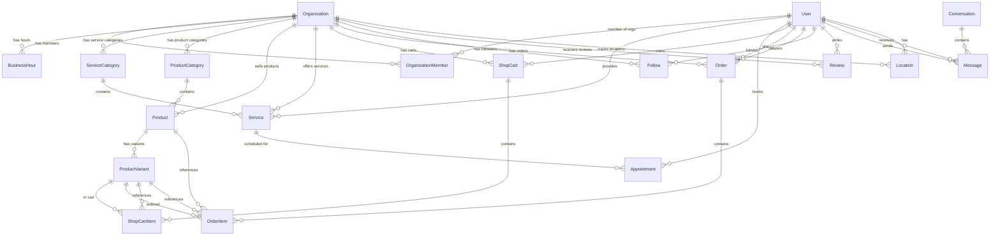

# Comprehensive Schema Implementation Plan

## Executive Summary

This document provides exhaustive implementation guidance for the Prisma schema in a multi-tenant, multi-locale Next.js application. The schema supports two business types: **SHOP** (e-commerce) and **APPOINTMENT** (booking services), with robust role-based access control, order management, and messaging capabilities.

---

## Part 1: Schema Analysis

### 1.1 Data Models Overview

The schema contains **16 models** organized into the following categories:

| Category | Models |
|----------|--------|
| Core | `Organization`, `User`, `OrganizationMember`, `BusinessHour` |
| Appointment | `ServiceCategory`, `Service`, `Appointment` |
| E-Commerce | `ProductCategory`, `Product`, `ProductVariant`, `ShopCart`, `ShopCartItem`, `Order`, `OrderItem` |
| Social/Feedback | `Review`, `Follow`, `Conversation`, `Message`, `Location` |

### 1.2 Enums

```prisma
enum OrganizationType { SHOP, APPOINTMENT }
enum UserRole { SUPER_ADMIN, ADMIN, MANAGER, STAFF, DRIVER, CUSTOMER }
enum OrgMemberRole { ADMIN, MANAGER, STAFF }
enum AppointmentStatus { PENDING, CONFIRMED, COMPLETED, CANCELLED, NO_SHOW }
enum CartStatus { ACTIVE, CHECKED_OUT, ABANDONED }
enum OrderType { DELIVERY, PICK_UP }
enum OrderStatus { PENDING, PLACED, ACCEPTED, PREPARING, READY, PICKED_UP, DELIVERED, RECEIVED, REFUNDED }
enum DayOfWeek { MONDAY, TUESDAY, WEDNESDAY, THURSDAY, FRIDAY, SATURDAY, SUNDAY }
```

### 1.3 Field Analysis

#### Organization Model
| Field | Type | Required | Default | Constraints |
|-------|------|----------|---------|-------------|
| id | String | Yes | cuid() | @id |
| type | OrganizationType | Yes | - | - |
| locale | String | Yes | "en" | - |
| name | String | Yes | - | - |
| slug | String | Yes | - | @unique |
| description | String? | No | - | @db.Text |
| address | String? | No | - | - |
| phone | String? | No | - | - |
| email | String? | No | - | - |
| logo | String? | No | - | - |
| coverImage | String? | No | - | - |
| isActive | Boolean | Yes | true | - |
| createdAt | DateTime | Yes | now() | - |
| updatedAt | DateTime | Yes | - | @updatedAt |
| deletedAt | DateTime? | No | - | Soft delete |

#### User Model
| Field | Type | Required | Default | Constraints |
|-------|------|----------|---------|-------------|
| id | String | Yes | cuid() | @id |
| email | String | Yes | - | @unique |
| password | String | Yes | - | - |
| firstName | String | Yes | - | - |
| lastName | String | Yes | - | - |
| phone | String? | No | - | - |
| avatar | String? | No | - | - |
| role | UserRole | Yes | CUSTOMER | - |
| isActive | Boolean | Yes | true | - |
| isTeamMember | Boolean | Yes | false | - |
| locale | String | Yes | "en" | - |
| theme | String | Yes | "light" | - |
| createdAt | DateTime | Yes | now() | - |
| updatedAt | DateTime | Yes | - | @updatedAt |
| deletedAt | DateTime? | No | - | Soft delete |

### 1.4 Relationships



---

## Part 2: API Endpoint Recommendations

### 2.1 RESTful API Design

#### Authentication Endpoints
| Method | Endpoint | Description |
|--------|----------|-------------|
| POST | /api/auth/register | Register new user |
| POST | /api/auth/login | User login |
| POST | /api/auth/logout | User logout |
| POST | /api/auth/refresh | Refresh JWT token |
| GET | /api/auth/me | Get current user |

#### Organization Endpoints
| Method | Endpoint | Description |
|--------|----------|-------------|
| GET | /api/organizations | List all organizations |
| POST | /api/organizations | Create organization |
| GET | /api/organizations/:slug | Get organization by slug |
| PATCH | /api/organizations/:id | Update organization |
| DELETE | /api/organizations/:id | Soft delete organization |
| GET | /api/organizations/:id/business-hours | Get business hours |
| PUT | /api/organizations/:id/business-hours | Update business hours |

#### User Management Endpoints
| Method | Endpoint | Description |
|--------|----------|-------------|
| GET | /api/users | List users (admin) |
| GET | /api/users/:id | Get user profile |
| PATCH | /api/users/:id | Update user |
| DELETE | /api/users/:id | Soft delete user |
| POST | /api/users/:id/activate | Activate user |
| POST | /api/users/:id/deactivate | Deactivate user |

#### Organization Member Endpoints
| Method | Endpoint | Description |
|--------|----------|-------------|
| GET | /api/organizations/:id/members | List organization members |
| POST | /api/organizations/:id/members | Invite member to organization |
| PATCH | /api/organizations/:id/members/:userId | Update member role |
| DELETE | /api/organizations/:id/members/:userId | Remove member |

#### Service/Appointment Endpoints
| Method | Endpoint | Description |
|--------|----------|-------------|
| GET | /api/organizations/:id/service-categories | List service categories |
| POST | /api/organizations/:id/service-categories | Create category |
| GET | /api/services | List services (with filters) |
| POST | /api/services | Create service |
| GET | /api/services/:id | Get service details |
| PATCH | /api/services/:id | Update service |
| DELETE | /api/services/:id | Soft delete service |
| GET | /api/appointments | List appointments |
| POST | /api/appointments | Create appointment |
| GET | /api/appointments/:id | Get appointment |
| PATCH | /api/appointments/:id | Update appointment (status) |
| DELETE | /api/appointments/:id | Cancel appointment |

#### Product/E-commerce Endpoints
| Method | Endpoint | Description |
|--------|----------|-------------|
| GET | /api/organizations/:id/product-categories | List product categories |
| POST | /api/organizations/:id/product-categories | Create category |
| GET | /api/products | List products (with filters) |
| POST | /api/products | Create product |
| GET | /api/products/:id | Get product details |
| PATCH | /api/products/:id | Update product |
| DELETE | /api/products/:id | Soft delete product |
| GET | /api/products/:id/variants | List product variants |
| POST | /api/products/:id/variants | Create variant |
| PATCH | /api/variants/:id | Update variant |

#### Cart Endpoints
| Method | Endpoint | Description |
|--------|----------|-------------|
| GET | /api/cart | Get current user's cart |
| POST | /api/cart/items | Add item to cart |
| PATCH | /api/cart/items/:itemId | Update cart item quantity |
| DELETE | /api/cart/items/:itemId | Remove item from cart |
| DELETE | /api/cart | Clear cart |

#### Order Endpoints
| Method | Endpoint | Description |
|--------|----------|-------------|
| GET | /api/orders | List orders |
| POST | /api/orders | Create order (checkout) |
| GET | /api/orders/:id | Get order details |
| PATCH | /api/orders/:id | Update order status |
| POST | /api/orders/:id/cancel | Cancel order |
| GET | /api/orders/:id/tracking | Track order (driver location) |

#### Review & Follow Endpoints
| Method | Endpoint | Description |
|--------|----------|-------------|
| GET | /api/organizations/:id/reviews | List organization reviews |
| POST | /api/organizations/:id/reviews | Create review |
| PATCH | /api/reviews/:id | Update review |
| DELETE | /api/reviews/:id | Delete review |
| POST | /api/organizations/:id/follow | Follow organization |
| DELETE | /api/organizations/:id/follow | Unfollow organization |
| GET | /api/users/:id/following | Get user's followed orgs |

#### Messaging Endpoints
| Method | Endpoint | Description |
|--------|----------|-------------|
| GET | /api/conversations | List conversations |
| POST | /api/conversations | Start conversation |
| GET | /api/conversations/:id | Get conversation messages |
| POST | /api/conversations/:id/messages | Send message |
| PATCH | /api/messages/:id/read | Mark message as read |

---

## Part 3: Business Logic Layer Organization

### 3.1 Recommended Folder Structure

```
src/
├── app/                    # Next.js App Router
│   ├── (auth)/            # Auth routes
│   ├── (dashboard)/       # Protected dashboard routes
│   └── api/               # API routes
├── lib/
│   ├── db.ts             # Prisma client instance
│   └── utils.ts          # Utility functions
├── services/             # Business logic layer
│   ├── auth/
│   │   ├── auth.service.ts
│   │   └── permissions.service.ts
│   ├── organization/
│   │   ├── organization.service.ts
│   │   ├── member.service.ts
│   │   └── business-hours.service.ts
│   ├── appointment/
│   │   ├── service-category.service.ts
│   │   ├── service.service.ts
│   │   └── appointment.service.ts
│   ├── shop/
│   │   ├── product-category.service.ts
│   │   ├── product.service.ts
│   │   ├── cart.service.ts
│   │   └── order.service.ts
│   ├── social/
│   │   ├── review.service.ts
│   │   ├── follow.service.ts
│   │   └── messaging.service.ts
│   └── common/
│       ├── pagination.service.ts
│       └── audit.service.ts
├── repositories/         # Data access layer
│   ├── user.repository.ts
│   ├── organization.repository.ts
│   └── ...
├── validators/          # Zod validation schemas
│   ├── auth.validator.ts
│   ├── organization.validator.ts
│   └── ...
├── middleware/          # Next.js middleware
│   ├── auth.middleware.ts
│   └── rbac.middleware.ts
└── types/               # TypeScript types
    ├── api.types.ts
    └── domain.types.ts
```

### 3.2 Service Layer Patterns

```typescript
// Example: Order Service Pattern
// services/shop/order.service.ts

export class OrderService {
  async createOrder(data: CreateOrderInput, userId: string) {
    // 1. Validate cart exists and belongs to user
    // 2. Calculate totals
    // 3. Check inventory
    // 4. Create order with items
    // 5. Clear cart
    // 6. Emit event (optional)
  }

  async updateOrderStatus(orderId: string, status: OrderStatus, userId: string) {
    // 1. Validate permissions
    // 2. Validate status transition
    // 3. Update order
    // 4. Handle side effects (notifications)
  }

  async getOrdersByOrganization(orgId: string, pagination: PaginationParams) {
    // 1. Check organization access
    // 2. Apply filters
    // 3. Return paginated results
  }
}
```

---

## Part 4: Data Validation Rules

### 4.1 Field-Level Validation

| Model | Field | Validation Rules |
|-------|-------|-------------------|
| User | email | Required, valid email format, unique, max 255 chars |
| User | password | Required, min 8 chars, max 72 chars (bcrypt limit) |
| User | firstName | Required, min 1, max 100 chars |
| User | lastName | Required, min 1, max 100 chars |
| User | phone | Optional, valid phone format |
| Organization | name | Required, min 2, max 200 chars |
| Organization | slug | Required, lowercase, alphanumeric with hyphens, unique, 3-60 chars |
| Organization | email | Optional, valid email format |
| Organization | phone | Optional, valid phone format |
| Service | name | Required, min 2, max 200 chars |
| Service | price | Required, >= 0, <= 999999999999 (12,2) |
| Service | duration | Required, >= 1, <= 1440 minutes (24 hours) |
| Product | name | Required, min 2, max 200 chars |
| Product | basePrice | Required, >= 0 |
| ProductVariant | price | Optional, if set must be >= 0 |
| ProductVariant | inventory | Required, >= 0 |
| ProductVariant | sku | Optional, unique if provided |
| Order | deliveryAddress | Required if type=DELIVERY |
| OrderItem | quantity | Required, >= 1 |
| Appointment | date | Required, must be in future |
| Appointment | startTime | Required |
| Appointment | endTime | Required, must be after startTime |
| Review | rating | Required, 1-5 integer |
| Review | comment | Optional, max 2000 chars |
| Message | content | Required, non-empty, max 10000 chars |

### 4.2 Business Rules Validation

```typescript
// validators/order.validator.ts
import { z } from 'zod';

export const createOrderSchema = z.object({
  organizationId: z.string().cuid(),
  type: z.enum(['DELIVERY', 'PICK_UP']),
  deliveryAddress: z.string().optional(),
  notes: z.string().max(1000).optional(),
}).refine(
  (data) => data.type === 'PICK_UP' || data.deliveryAddress,
  { message: "Delivery address required for delivery orders" }
);

export const updateOrderStatusSchema = z.object({
  status: z.enum(['PENDING', 'PLACED', 'ACCEPTED', 'PREPARING', 'READY', 'PICKED_UP', 'DELIVERED', 'RECEIVED', 'REFUNDED']),
});

// validators/appointment.validator.ts
export const createAppointmentSchema = z.object({
  serviceId: z.string().cuid(),
  date: z.string().datetime(),
  startTime: z.string().datetime(),
  notes: z.string().max(2000).optional(),
}).refine(
  (data) => new Date(data.startTime) > new Date(),
  { message: "Appointment must be scheduled in the future" }
);
```

---

## Part 5: Authentication & Authorization Patterns

### 5.1 Authentication Strategy

```typescript
// JWT-based authentication with NextAuth.js (recommended)
// For integration with this schema:

import { NextAuth } from "next-auth";
import CredentialsProvider from "next-auth/providers/credentials";
import { PrismaAdapter } from "@auth/prisma-adapter";
import { prisma } from "@/lib/db";
import bcrypt from "bcrypt";

export const authOptions = {
  adapter: PrismaAdapter(prisma),
  providers: [
    CredentialsProvider({
      name: "credentials",
      credentials: {
        email: { label: "Email", type: "email" },
        password: { label: "Password", type: "password" }
      },
      async authorize(credentials) {
        const user = await prisma.user.findUnique({
          where: { email: credentials.email }
        });
        
        if (!user || !user.isActive) return null;
        
        const isValid = await bcrypt.compare(credentials.password, user.password);
        if (!isValid) return null;
        
        return {
          id: user.id,
          email: user.email,
          role: user.role,
          locale: user.locale,
        };
      }
    })
  ],
  callbacks: {
    async jwt({ token, user }) {
      if (user) {
        token.role = user.role;
        token.isTeamMember = user.isTeamMember;
      }
      return token;
    },
    async session({ session, token }) {
      session.user.id = token.sub;
      session.user.role = token.role;
      session.user.isTeamMember = token.isTeamMember;
      return session;
    }
  }
};
```

### 5.2 Role-Based Access Control (RBAC)

```typescript
// types/permissions.ts
export type Permission = 
  | 'org:create'
  | 'org:read'
  | 'org:update'
  | 'org:delete'
  | 'org:manage_members'
  | 'org:manage_hours'
  | 'service:create'
  | 'service:read'
  | 'service:update'
  | 'service:delete'
  | 'product:create'
  | 'product:read'
  | 'product:update'
  | 'product:delete'
  | 'order:read'
  | 'order:update'
  | 'order:assign_driver'
  | 'appointment:read'
  | 'appointment:create'
  | 'appointment:update'
  | 'appointment:cancel'
  | 'review:create'
  | 'review:manage'
  | 'user:manage';

export const rolePermissions: Record<UserRole, Permission[]> = {
  SUPER_ADMIN: [
    'org:create', 'org:read', 'org:update', 'org:delete',
    'org:manage_members', 'org:manage_hours',
    'service:create', 'service:read', 'service:update', 'service:delete',
    'product:create', 'product:read', 'product:update', 'product:delete',
    'order:read', 'order:update', 'order:assign_driver',
    'appointment:read', 'appointment:create', 'appointment:update', 'appointment:cancel',
    'review:create', 'review:manage', 'user:manage'
  ],
  ADMIN: [
    'org:read', 'org:update',
    'org:manage_members', 'org:manage_hours',
    'service:create', 'service:read', 'service:update', 'service:delete',
    'product:create', 'product:read', 'product:update', 'product:delete',
    'order:read', 'order:update', 'order:assign_driver',
    'appointment:read', 'appointment:create', 'appointment:update', 'appointment:cancel',
    'review:manage'
  ],
  MANAGER: [
    'org:read',
    'service:create', 'service:read', 'service:update',
    'product:create', 'product:read', 'product:update',
    'order:read', 'order:update',
    'appointment:read', 'appointment:create', 'appointment:update'
  ],
  STAFF: [
    'org:read',
    'service:read',
    'product:read',
    'order:read', 'order:update',
    'appointment:read', 'appointment:update'
  ],
  DRIVER: [
    'org:read',
    'order:read', 'order:update'
  ],
  CUSTOMER: [
    'org:read',
    'service:read',
    'product:read',
    'order:read', 'order:create',
    'appointment:read', 'appointment:create', 'appointment:cancel',
    'review:create'
  ]
};

export function hasPermission(role: UserRole, permission: Permission): boolean {
  return rolePermissions[role]?.includes(permission) ?? false;
}
```

### 5.3 Organization-Level Access

```typescript
// Check if user is member of organization with specific role
export async function checkOrganizationAccess(
  userId: string,
  organizationId: string,
  requiredRoles?: OrgMemberRole[]
) {
  const membership = await prisma.organizationMember.findUnique({
    where: {
      organizationId_userId: { organizationId, userId }
    }
  });
  
  if (!membership?.isActive) return false;
  
  if (requiredRoles?.length) {
    return requiredRoles.includes(membership.role);
  }
  
  return true;
}

// Middleware example
export async function withOrganizationAccess(
  handler: NextApiHandler,
  requiredRoles: OrgMemberRole[] = []
) {
  return async (req: NextApiRequest, res: NextApiResponse) => {
    const session = await getServerSession(authOptions);
    if (!session) return res.status(401).json({ error: 'Unauthorized' });
    
    const orgId = req.query.organizationId as string;
    const hasAccess = await checkOrganizationAccess(
      session.user.id,
      orgId,
      requiredRoles
    );
    
    if (!hasAccess) {
      return res.status(403).json({ error: 'Forbidden' });
    }
    
    return handler(req, res);
  };
}
```

---

## Part 6: Identified Gaps in the Data Model

### 6.1 Missing Fields

| Model | Missing Field | Purpose |
|-------|---------------|----------|
| Organization | settings | JSON blob for custom configuration |
| Organization | timezone | For accurate business hours handling |
| User | emailVerified | For email verification status |
| User | lastLoginAt | Track last login timestamp |
| User | passwordResetToken | Password reset functionality |
| User | passwordResetExpires | Token expiration |
| Service | duration | Already exists ✓ |
| ServiceCategory | sortOrder | Display ordering |
| Product | sortOrder | Display ordering |
| Product | sku | Could be added at product level |
| ProductCategory | sortOrder | Display ordering |
| ServiceCategory | sortOrder | Display ordering |
| Order | paidAt | Payment timestamp |
| Order | paymentMethod | Payment method tracking |
| Order | paymentId | External payment reference |
| OrderItem | discount | Item-level discount |
| Appointment | cancelledAt | Cancellation timestamp |
| Appointment | cancellationReason | Reason for cancellation |
| Message | readAt | Read timestamp |

### 6.2 Incomplete Relationships

1. **Service.serviceProviderId** - Required but should probably be optional (some services don't have specific providers)
2. **Conversation** - Uses String[] for participants but should be a proper relation table for better query performance
3. **Location** - Missing organizationId index in some cases

### 6.3 Missing Features

| Feature | Priority | Description |
|---------|----------|-------------|
| Audit Trail | High | No history of changes to critical entities |
| Soft Delete | Medium | Partial implementation - only some models have deletedAt |
| Pagination | Medium | No cursor-based pagination support in queries |
| Multi-tenancy filters | High | Every query needs organizationId filter |
| Order Status Transitions | Medium | No enforcement of valid state machine transitions |
| Inventory Management | High | No reservation system for cart items |
| Tax Calculation | Medium | No tax fields on orders |
| Discount/Promo Codes | Low | Not supported |

---

## Part 7: Recommended Schema Improvements

### 7.1 Additional Models

```prisma
// Audit Log Model
model AuditLog {
  id            String   @id @default(cuid())
  action        String   // e.g., "order.created", "user.updated"
  entityType    String   // e.g., "Order", "User"
  entityId      String
  userId        String?
  organizationId String?
  changes       Json     // Before/after values
  ipAddress     String?
  userAgent     String?
  createdAt     DateTime @default(now())
  
  @@index([entityType, entityId])
  @@index([userId])
  @@index([organizationId])
  @@index([createdAt])
}

// Password Reset Model
model PasswordReset {
  id        String   @id @default(cuid())
  userId    String
  token     String   @unique
  expiresAt DateTime
  usedAt    DateTime?
  createdAt DateTime @default(now())
  
  user      User     @relation(fields: [userId], references: [id])
}

// Email Verification Model
model EmailVerification {
  id        String   @id @default(cuid())
  userId    String   @unique
  token     String   @unique
  expiresAt DateTime
  verifiedAt DateTime?
  createdAt DateTime @default(now())
  
  user      User     @relation(fields: [userId], references: [id])
}

// Organization Settings
model OrganizationSettings {
  id             String   @id @default(cuid())
  organizationId String   @unique
  settings       Json     // Flexible configuration
  createdAt      DateTime @default(now())
  updatedAt      DateTime @updatedAt
  
  organization   Organization @relation(fields: [organizationId], references: [id])
}

// Payment Model
model Payment {
  id             String    @id @default(cuid())
  amount         Decimal   @db.Decimal(12, 2)
  method         String    // e.g., "credit_card", "cash", "wallet"
  status         String    // "pending", "completed", "failed", "refunded"
  transactionId  String?   // External payment gateway ID
  
  orderId        String    @unique
  order          Order     @relation(fields: [orderId], references: [id])
  
  createdAt      DateTime  @default(now())
  updatedAt      DateTime  @updatedAt
}

// Promotion/Discount Model
model Promotion {
  id              String    @id @default(cuid())
  code            String    @unique
  description     String?
  discountType    String    // "percentage" | "fixed"
  discountValue   Decimal   @db.Decimal(12, 2)
  minOrderAmount  Decimal?  @db.Decimal(12, 2)
  maxUses         Int?
  usedCount       Int       @default(0)
  startsAt        DateTime
  expiresAt       DateTime
  isActive        Boolean   @default(true)
  
  organizationId  String
  organization    Organization @relation(fields: [organizationId], references: [id])
  
  orders          Order[]
  
  createdAt       DateTime  @default(now())
  
  @@index([organizationId])
  @@index([code])
}

// Appointment Cancellation
model AppointmentCancellation {
  id              String   @id @default(cuid())
  appointmentId   String   @unique
  reason          String?
  cancelledBy     String   // userId
  cancelledAt     DateTime @default(now())
  
  appointment     Appointment @relation(fields: [appointmentId], references: [id])
}
```

### 7.2 Modified Models

```prisma
// User - Add missing fields
model User {
  // ... existing fields
  emailVerified    DateTime?
  lastLoginAt     DateTime?
  passwordResetToken    String?
  passwordResetExpires DateTime?
  
  // Add relation to AuditLog
  auditLogs        AuditLog[]
  
  // Add relation to PasswordReset
  passwordResets   PasswordReset[]
  
  // Add relation to EmailVerification
  emailVerifications EmailVerification[]
}

// Organization - Add timezone and settings
model Organization {
  // ... existing fields
  timezone         String     @default("UTC")
  
  // Add relation
  settings         OrganizationSettings?
  promotions       Promotion[]
}

// Order - Add payment and promotion fields
model Order {
  // ... existing fields
  paidAt           DateTime?
  paymentMethod    String?
  paymentId       String?
  discount         Decimal    @db.Decimal(12, 2) @default(0)
  tax              Decimal    @db.Decimal(12, 2) @default(0)
  promotionId      String?
  promotion        Promotion? @relation(fields: [promotionId], references: [id])
  
  // Add payment relation
  payment          Payment?
}

// Conversation - Replace String[] with proper relation
model Conversation {
  id            String    @id @default(cuid())
  type          String    @default("direct") // "direct" | "group"
  name          String?   // For group chats
  
  createdAt     DateTime  @default(now())
  updatedAt     DateTime  @updatedAt

  participants  ConversationParticipant[]
  messages      Message[]
}

model ConversationParticipant {
  id             String       @id @default(cuid())
  conversationId String
  userId         String
  role           String       @default("member") // "member" | "admin"
  joinedAt       DateTime     @default(now())
  
  conversation   Conversation @relation(fields: [conversationId], references: [id], onDelete: Cascade)
  user           User         @relation(fields: [userId], references: [id])
  
  @@unique([conversationId, userId])
}
```

---

## Part 8: Best Practices

### 8.1 Project Structure

```
├── prisma/
│   ├── schema.prisma          # Main schema
│   ├── seed.ts                # Database seeding
│   └── migrations/            # Migration history
├── src/
│   ├── app/                   # Next.js App Router
│   │   ├── (auth)/
│   │   │   ├── login/
│   │   │   └── register/
│   │   ├── (dashboard)/
│   │   │   ├── organization/
│   │   │   │   └── [slug]/
│   │   │   ├── orders/
│   │   │   ├── appointments/
│   │   │   └── settings/
│   │   └── api/
│   │       ├── v1/
│   │       │   ├── auth/
│   │       │   ├── organizations/
│   │       │   ├── orders/
│   │       │   └── ...
│   │       └── trpc/          # Optional: tRPC endpoints
│   ├── components/
│   │   ├── ui/               # shadcn components
│   │   ├── forms/            # Form components
│   │   └── layouts/          # Layout components
│   ├── lib/
│   │   ├── db.ts             # Prisma client
│   │   ├── auth.ts           # NextAuth config
│   │   └── utils.ts          # Utilities
│   ├── services/             # Business logic
│   ├── repositories/         # Data access
│   ├── validators/           # Zod schemas
│   ├── middleware/           # Next.js middleware
│   ├── types/               # TypeScript types
│   └── hooks/               # React hooks
├── public/                   # Static assets
├── tests/                    # Test files
│   ├── unit/
│   ├── integration/
│   └── e2e/
└── scripts/                  # Utility scripts
```

### 8.2 Database Migration Approach

```bash
# Development workflow
1. Make changes to schema.prisma
2. Run: npx prisma migrate dev --name descriptive_name
3. Review generated SQL
4. Test in development environment
5. Push to version control

# Production workflow
1. Create migration: npx prisma migrate dev --name add_audit_log
2. Review and test thoroughly
3. Deploy migration: npx prisma migrate deploy
4. Or use Prisma Accelerate for serverless migrations

# Never use prisma db push in production - only for prototyping
```

### 8.3 Error Handling Strategy

```typescript
// lib/errors/app-error.ts
export class AppError extends Error {
  constructor(
    public statusCode: number,
    public message: string,
    public code?: string,
    public isOperational = true
  ) {
    super(message);
    Object.setPrototypeOf(this, AppError.prototype);
  }
}

export class NotFoundError extends AppError {
  constructor(resource: string) {
    super(404, `${resource} not found`, 'NOT_FOUND');
  }
}

export class ValidationError extends AppError {
  constructor(message: string, public details?: any) {
    super(400, message, 'VALIDATION_ERROR');
  }
}

export class UnauthorizedError extends AppError {
  constructor(message = 'Unauthorized') {
    super(401, message, 'UNAUTHORIZED');
  }
}

export class ForbiddenError extends AppError {
  constructor(message = 'Forbidden') {
    super(403, message, 'FORBIDDEN');
  }
}

// API error handler middleware
export function errorHandler(err: Error, req: Request, res: Response, next: NextFunction) {
  if (err instanceof AppError) {
    return res.status(err.statusCode).json({
      error: {
        code: err.code,
        message: err.message,
        ...(err.details && { details: err.details })
      }
    });
  }
  
  // Unexpected errors
  console.error('Unexpected error:', err);
  return res.status(500).json({
    error: {
      code: 'INTERNAL_ERROR',
      message: 'An unexpected error occurred'
    }
  });
}
```

### 8.4 Testing Strategy

#### Unit Tests
```typescript
// tests/unit/validators/order.validator.test.ts
import { createOrderSchema } from '@/validators/order.validator';

describe('Order Validator', () => {
  describe('createOrderSchema', () => {
    it('should reject delivery order without address', () => {
      const result = createOrderSchema.safeParse({
        organizationId: 'org123',
        type: 'DELIVERY'
      });
      expect(result.success).toBe(false);
    });
    
    it('should accept valid delivery order', () => {
      const result = createOrderSchema.safeParse({
        organizationId: 'org123',
        type: 'DELIVERY',
        deliveryAddress: '123 Main St'
      });
      expect(result.success).toBe(true);
    });
    
    it('should accept pick-up order without address', () => {
      const result = createOrderSchema.safeParse({
        organizationId: 'org123',
        type: 'PICK_UP'
      });
      expect(result.success).toBe(true);
    });
  });
});
```

#### Integration Tests
```typescript
// tests/integration/order.service.test.ts
import { prisma } from '@/lib/db';
import { OrderService } from '@/services/shop/order.service';

describe('OrderService', () => {
  const orderService = new OrderService();
  
  beforeAll(async () => {
    // Set up test data
  });
  
  afterAll(async () => {
    // Clean up test data
  });
  
  describe('createOrder', () => {
    it('should create order from cart', async () => {
      const order = await orderService.createOrder({
        organizationId: 'org123',
        customerId: 'user123',
        type: 'PICK_UP'
      });
      
      expect(order).toBeDefined();
      expect(order.status).toBe('PENDING');
    });
  });
});
```

#### E2E Tests
```typescript
// tests/e2e/order-flow.test.ts
import { test, expect } from '@playwright/test';

test('complete order flow', async ({ page }) => {
  // 1. Login
  await page.goto('/login');
  await page.fill('[name=email]', 'customer@test.com');
  await page.fill('[name=password]', 'password123');
  await page.click('[type=submit]');
  
  // 2. Browse products
  await page.goto('/organization/shop-slug');
  await page.click('[data-product-id="prod123"]');
  
  // 3. Add to cart
  await page.click('[data-variant-id="var123"]');
  await page.click('button:has-text("Add to Cart")');
  
  // 4. Checkout
  await page.click('a[href="/cart"]');
  await page.click('button:has-text("Checkout")');
  
  // 5. Confirm order
  await expect(page.locator('[data-order-number]')).toBeVisible();
});
```

### 8.5 Prisma Middleware for Soft Delete

```typescript
// lib/db.ts
import { PrismaClient } from '@prisma/client';

const prisma = new PrismaClient({
  log: ['query', 'info', 'warn', 'error']
});

// Soft delete middleware
prisma.$use(async (params, next) => {
  // Check if model has deletedAt field
  if (params.model && ['Organization', 'User', 'Product', 'Order'].includes(params.model)) {
    if (params.action === 'delete') {
      // Convert delete to update with deletedAt
      params.action = 'update';
      params.args['data'] = { deletedAt: new Date() };
    }
    
    if (params.action === 'findUnique') {
      // Add deletedAt filter to findUnique
      params.action = 'findFirst';
      params.args.where['deletedAt'] = null;
    }
    
    if (params.action === 'findMany') {
      // Add deletedAt filter to findMany
      if (!params.args.where) {
        params.args.where = {};
      }
      params.args.where['deletedAt'] = null;
    }
  }
  
  return next(params);
});

export { prisma };
```

### 8.6 Performance Optimizations

1. **Use select/include sparingly**: Only fetch needed fields
2. **Implement connection pooling**: Use Prisma Accelerate or PgBouncer
3. **Add pagination**: Use cursor-based pagination for large datasets
4. **Leverage indexes**: The schema already includes important indexes
5. **Use raw queries** for complex aggregations when needed
6. **Consider read replicas** for heavy read operations

---

## Part 9: Implementation Checklist

- [ ] Set up NextAuth.js with credentials provider
- [ ] Implement RBAC middleware
- [ ] Create Zod validators for all endpoints
- [ ] Build service layer with business logic
- [ ] Implement pagination utilities
- [ ] Add soft delete middleware
- [ ] Set up audit logging
- [ ] Configure database connection pooling
- [ ] Write unit tests for validators
- [ ] Write integration tests for services
- [ ] Set up E2E tests with Playwright
- [ ] Implement error handling middleware
- [ ] Add rate limiting
- [ ] Configure CORS policies

---

## Appendix: Quick Reference

### Enum Values Reference

| Enum | Values |
|------|--------|
| OrganizationType | SHOP, APPOINTMENT |
| UserRole | SUPER_ADMIN, ADMIN, MANAGER, STAFF, DRIVER, CUSTOMER |
| OrgMemberRole | ADMIN, MANAGER, STAFF |
| AppointmentStatus | PENDING, CONFIRMED, COMPLETED, CANCELLED, NO_SHOW |
| CartStatus | ACTIVE, CHECKED_OUT, ABANDONED |
| OrderType | DELIVERY, PICK_UP |
| OrderStatus | PENDING, PLACED, ACCEPTED, PREPARING, READY, PICKED_UP, DELIVERED, RECEIVED, REFUNDED |

### Order Status Flow

```
DELIVERY:  PENDING → PLACED → ACCEPTED → PREPARING → READY → PICKED_UP → DELIVERED → RECEIVED
PICK_UP:   PENDING → PLACED → ACCEPTED → PREPARING → READY → PICKED_UP → RECEIVED
CANCELLATION: Any state → CANCELLED (with conditions)
REFUND:   After RECEIVED → REFUNDED
```

### Key Indexes

- Organization: type, slug, isActive
- User: email, role
- Order: organizationId, customerId, status, createdAt
- Product: organizationId, isActive
- Appointment: customerId, date
- Message: conversationId
- Location: userId, timestamp
